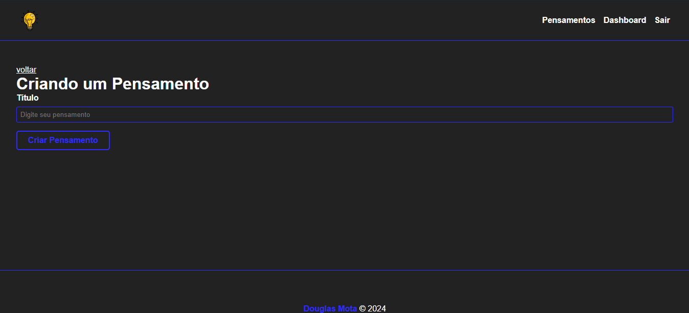
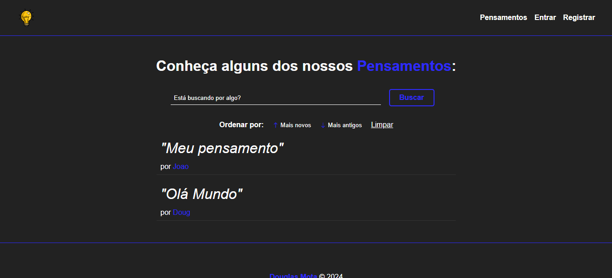
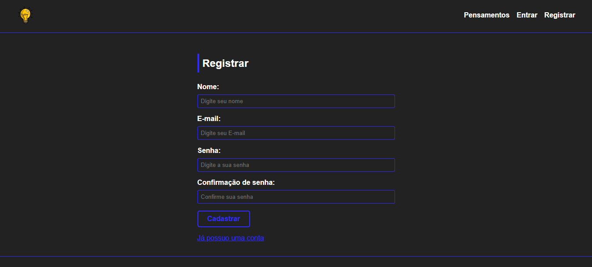
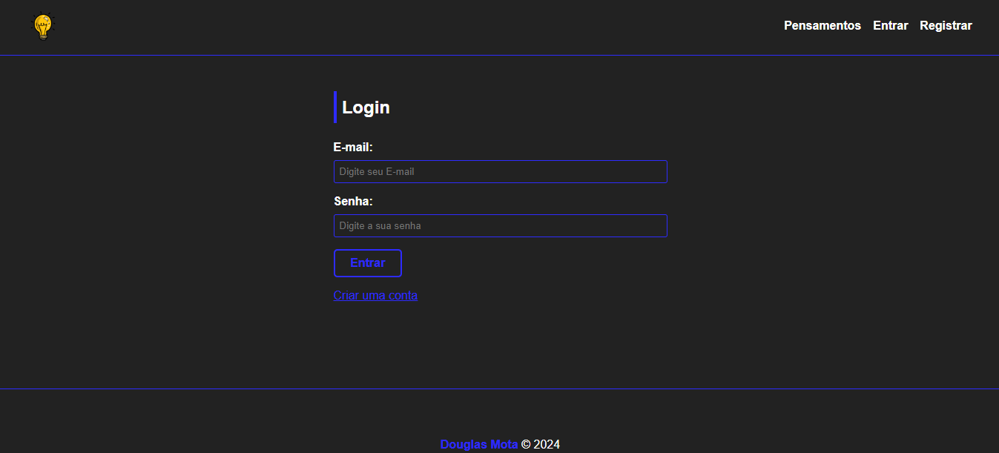

# tought-blog

Projeto simples de um blog, utilizando MySQL, Sequelize e Handlebars

# Tela de criação de um novo pensamento

# Tela Inicial com login feito

# Tela Inicial sem Login

# Registro

# Login

